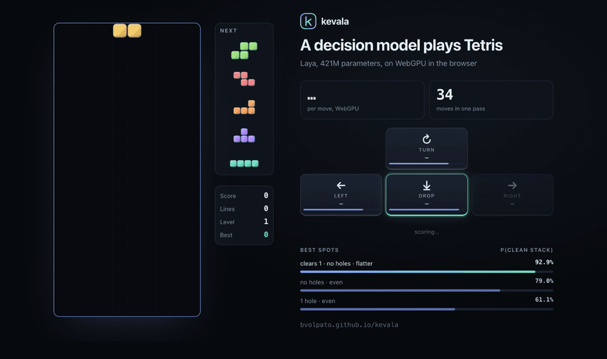

<h1 align="center">kevala</h1>

<p align="center"><b>Ask questions about text with Laya, Kev, SemIf, and Gemma 4 running on the user's own hardware.</b></p>

<p align="center">
  <a href="https://bvolpato.github.io/kevala/#/tetris"></a>
</p>

<p align="center">
  <a href="https://bvolpato.github.io/kevala/">Live site</a> ·
  <a href="https://bvolpato.github.io/kevala/#/playground">Playground</a> ·
  <a href="https://bvolpato.github.io/kevala/#/tetris">Tetris</a> ·
  <a href="https://www.npmjs.com/package/kevala">npm</a> ·
  <a href="examples/">Examples</a> ·
  <a href="docs/architecture.md">How it works</a>
</p>

kevala runs [Laya](https://huggingface.co/convaiinnovations/laya),
[Kev](https://github.com/jaredpalmer/kev), frozen Qwen3.5 models, and
[Gemma 4](docs/gemma4.md) with [SemIf option scoring](docs/models.md#how-semif-scoring-works)
inside the browser.
You give it text or JSON and typed questions (`noul` for yes/no, `choice`, `score`), and it scores
the options without generating an answer token by token. There is no model server, no API key,
and no data leaving the tab.

The engine is Rust with zero dependencies, compiled to WebAssembly, plus WebGPU kernels written for
these models. The browser runtime is a few plain ES modules. The first load downloads a pinned int8
pack of the model from [Hugging Face](https://huggingface.co/bvolpato/kevala-packs) and keeps it in
the browser, so there is nothing to host. Laya and Kev-0.8B also support conversion from the
original checkpoint in the browser. Larger Kev models, SemIf models, and Gemma 4 require a converted
pack.

## Quick start

From a CDN, in any page:

```html
<script type="module">
  import { Kevala } from "https://cdn.jsdelivr.net/npm/kevala@latest/js/src/index.js";

  const kevala = await Kevala.load({ model: "laya", onProgress: console.log });
  const r = await kevala.decide("We were billed twice. Refund the duplicate today or we cancel.", {
    team: { type: "choice", instructions: "Which team should handle this?",
            criteria: { billing: "invoices, payments, refunds", technical: "bugs, outages", other: "anything else" } },
    churn: { type: "noul", instructions: "Does the customer threaten to leave?" },
  });
  console.log(r.answers.team.choice, r.answers.churn.noul); // "billing" 0.87
</script>
```

Or install from the npm registry with pnpm, with any bundler (Vite, webpack, esbuild) or none:

```sh
pnpm add kevala
```

```js
import { Kevala } from "kevala";
```

Building with a coding agent? The site has [a prompt to paste into it](https://bvolpato.github.io/kevala/#/home/agent),
and [`skills/kevala/SKILL.md`](skills/kevala/SKILL.md) is the same guide as an agent skill.

The first visit downloads the model's int8 pack from Hugging Face (Laya: 479 MB). Browser storage
avoids that download on later visits; loading still includes reading the weights, allocating memory,
and warming up the backend. Time depends on the model and hardware. It works from any origin and
needs no special headers. For Laya or Kev-0.8B, pass `from: "checkpoint"` to convert the original
weights in the browser. To serve weights yourself, pass the URL of a `.kevala` file. See
[Packs](docs/packs.md) for both, and for how the packs are made and published.

## Models

| Family | Model name | Decision readout | Pack download |
|---|---|---|---:|
| Laya | `laya` | Marker scorer and act head | 479 MB |
| Kev | `kev-0.8b` | Trained pointer head | 857 MB |
| Kev | `kev-4b` | Trained pointer head | 4.76 GB |
| Kev | `kev-9b` | Trained pointer head | 8.96 GB |
| SemIf | `semif-qwen3.5-0.8b` | Native option-label logits | 855 MB |
| SemIf | `semif-qwen3.5-2b` | Native option-label logits | 2.13 GB |
| SemIf | `semif-qwen3.5-4b` | Native option-label logits | 4.75 GB |
| Gemma 4 | `gemma-4-e2b` | Native option-label logits | 5.22 GB |
| Gemma 4 | `gemma-4-e4b` | Native option-label logits | 8.41 GB |

Laya uses a ModernBERT-large encoder. Kev uses Qwen3.5 base models with its merged LoRA adapter
and trained pointer head. SemIf applies direct option scoring to frozen Qwen3.5 instruction
models. Gemma 4 uses Google's frozen E2B and E4B instruction weights with the same direct option
readout; these are dense text-only packs with Gemma's per-layer embeddings, not MoE models. See
[the model guide](docs/models.md) and [Gemma 4 notes](docs/gemma4.md) for their differences and
backend limits.

Normal loading downloads the stored pack, not the upstream checkpoint. Pick with
`Kevala.load({ model: "kev-4b" })` or `Kevala.load({ model: "semif-qwen3.5-2b" })`,
or pass a `.kevala` URL you host.

Laya remains the demo default. Select **Kev** to choose 0.8B, 4B, or 9B with the size slider.
**SemIf** appears alongside Laya and Kev, with 0.8B, 2B, or 4B sizes. Selecting either family starts
at its smallest size; changing sizes waits for **Load** before downloading. **Gemma 4** starts with
E2B and can be changed to E4B before loading.

Sizes use decimal MB/GB and describe the pack, not total runtime memory. The Gemma packs are exactly
5,217,421,952 bytes (E2B) and 8,407,043,136 bytes (E4B). Load these as pre-converted
packs published on Hugging Face at a pinned revision. Browser checkpoint conversion is available
only for Laya and Kev-0.8B. Gemma 4 is text-only here and requires WebGPU in the browser or the
native 64-bit CPU CLI; its maximum input is 4096 tokens.

Families are pluggable: see [Adding a model family](docs/adding-a-model.md).

## Speed

For GPU measurements across the seven Laya, Kev, and SemIf models on Firefox/Linux, see
[GPU matrix tuning](docs/semif-matmul.md). Gemma 4's E2B and E4B checks are in the
[Gemma 4 notes](docs/gemma4.md). Performance depends on the model, request, and hardware.

On an Apple M4 Max, with WebGPU in Chrome:

| | Laya | Kev-0.8B |
|---|---:|---:|
| short request (one question, 30 to 45 tokens) | **11 ms** | **11 ms** |
| the same state asked again (cache hit) | | **10 ms** |

Laya scores 32 states in one pass in 186 ms, and Kev answers a 533-token state in 116 ms. Without
WebGPU, a short request takes about 0.4 s on one CPU core. The Playground's Profile tab (or
`kevala.profile(true)`) shows the time of every GPU kernel for any request. [`bench.html`](https://bvolpato.github.io/kevala/bench.html) measures your own machine.

Kev and SemIf reuse their state caches: all questions about a state share one pass over it, and the carries of recent
states stay resident, so a repeated state only runs its question tokens and a state that extends a
cached one (a growing conversation) only runs its new tokens. Laya is a bidirectional encoder, where a KV
cache is impossible; it packs every question of a request into one pass instead.

## Fidelity

Reference checks for Laya, Kev, and SemIf: [GPU validation](docs/semif-matmul.md#correctness-and-feature-fallbacks).
Gemma 4 checks: [Gemma 4 notes](docs/gemma4.md#verification). Conversion fidelity and seeded game
results: [model validation](docs/model-benchmarks.md).

The following fixtures are checked against upstream reference code
(`tools/golden.py` runs the `laya` SDK, `tools/golden_kev.py` runs Kev's own code, and
`tools/golden_gemma.py` runs the Gemma Transformers reference), natively and in
the browser. These results do not establish parity or quality beyond the listed fixtures.

| | token ids | argmax agreement | max probability difference |
|---|---|---|---|
| Laya, f32 weights | 41 / 41 exact | 41 / 41 | < 0.0001 |
| Laya, int8 pack (CPU, WebAssembly, WebGPU) | 41 / 41 exact | 41 / 41 | 0.024 |
| Kev-0.8B, int8 pack (CPU, WebAssembly, WebGPU) | 8 / 8 requests exact | 13 / 13 | 0.0097 |
| Gemma 4 E2B, int8 pack (WebGPU) | shared tokenizer | 12 / 12 | 0.01906186 |
| Gemma 4 E4B, int8 pack (WebGPU) | shared tokenizer | 12 / 12 | 0.0120864 |
| Gemma 4 E2B, int8 pack (native CPU) | 12 / 12 exact | 12 / 12 | 0.019120 |
| Gemma 4 E4B, int8 pack (native CPU, selected cases) | 3 / 3 exact | 3 / 3 | 0.009941 |

The Laya and Qwen tokenizers match the Hugging Face `tokenizers` library on the fixture corpora and
on about ten million fuzzed strings. Gemma's pinned tokenizer IDs are recorded by its reference
generator; see the [Gemma 4 notes](docs/gemma4.md#verification). Open
[`parity.html`](https://bvolpato.github.io/kevala/parity.html) to rerun the Laya check in your own browser.

## Demos and examples

- [Playground](https://bvolpato.github.io/kevala/#/playground): any state, any questions, any model
  and backend, with the response as highlighted JSON and the code to reproduce it.
- [Tetris](https://bvolpato.github.io/kevala/#/tetris): the model plays. When a piece appears, code
  lists every spot it can land in and describes each outcome in words; the model scores the candidates
  in batches, and the piece presses the keys (turn, left, right, drop) toward the best one.
- [Guardrail](https://bvolpato.github.io/kevala/#/guardrail): a prompt-injection and jailbreak gate in
  front of an LLM that acts on confident answers and escalates the unsure ones.
- [Inbox](https://bvolpato.github.io/kevala/#/inbox): triage a mailbox, with rows filling in as each
  batch of answers returns.
- [`examples/`](examples/): complete single-file pages you can copy into a site: a minimal page, a
  comment form that blocks toxic posts, an LLM cascade that escalates only the unsure cases, a game
  loop.
- [`skills/kevala/SKILL.md`](skills/kevala/SKILL.md): teaches a coding agent to add kevala to a site.

## API

```js
import { Kevala, MODELS, cacheInfo, clearCache } from "kevala";

const kevala = await Kevala.load({
  model: "laya",         // a MODELS name, a .kevala URL, or an ArrayBuffer/Blob
  backend: "auto",       // "webgpu", "wasm", or "auto" (WebGPU, then CPU if GPU loading fails)
  onPage: false,         // run on the page, not in a worker (automatic when only pages get WebGPU)
  threads: "auto",       // measure CPU worker counts; 1..16 overrides, capped by the model
  cpuKernel: "auto",     // measure CPU register tiles; "2x4" or "4x4" overrides
  gpuKernel: "auto",     // measure GPU matrices; "generic" or "wide" overrides
  retune: false,         // reuse the browser's CPU tuning profile; true measures again
  submit: "await",       // GPU chunks: "await" favors responsiveness; "split" reduces queue waits
  from: "pack",          // "checkpoint" conversion is available for Laya and Kev-0.8B
  cache: true,           // keep the pack and CPU tuning profile in origin storage
  onProgress: (p) => {}, // { phase: download | convert | cache | init | warmup, loaded, total }
  signal,                // AbortSignal
  plugins: [],           // URLs of extra architecture plugins
});

await kevala.decide(state, questions, { parts });  // score a request's questions
await kevala.decideMany([{ state, questions }]);   // batch requests; GPU work may split to fit
kevala.info;      // { arch, backend, gpu, gpuUnavailable, threads, cpuTiles, cpuTuning, gpuTuning, modalities, model, config, pack, loadMs }
await kevala.profile(true); // later responses carry timing.gpu: milliseconds per GPU kernel
kevala.dispose();
```

CPU tuning runs automatically and caches its result for the browser and model. See
[CPU tuning and API overrides](docs/cpu-tuning.md) for the measurements, limits, and diagnostics.
All model families also select GPU matrix kernels using the loaded model's shapes and GPU timestamps.
See [GPU matrix tuning](docs/semif-matmul.md) for the Laya, Kev, and SemIf results, and
[Gemma 4 notes](docs/gemma4.md) for the Gemma checks and backend details.

Questions use the System One request shape (`type`, `instructions`, `criteria`), and each family
answers in its own reference format: Laya like `laya` 0.3.5 (`action.act_probability`, 4 decimals),
Kev like `kev.serve` (2 decimals, plus `raw_probabilities` at full precision). SemIf packs use
the Kev response shape and return `probability_status` to identify uncalibrated conditional option
scores. They support at most 16 options per question. For starting points,
`import { presets } from "kevala"` has the `laya` SDK's question sets for triage, email,
guardrails, moderation and routing.

Requests may carry typed `parts` (`{ type: "text", text }`; `image` and `audio` for packs whose
`info.modalities` list them). A part the model cannot read is an error, never silently dropped.

Server side, the same engine runs in Node.js, Deno or Bun without workers or a GPU:

```js
import { loadFile } from "kevala/node";
const kevala = await loadFile("laya-q8.kevala");
kevala.decide("I want my money back.", { refund: { type: "noul", instructions: "Does the customer ask for money back?" } });
```

## How it works

```
page ─► index.js ─► engine worker ─► coordinator (Rust → WebAssembly): tokenizer, template, embeddings, head
                         ├─► WebGPU trunk: int8 matmul (split-K), attention, Gated DeltaNet, norms
                         └─► WebAssembly shard workers: tensor-parallel layers, no SharedArrayBuffer needed
```

- **One Rust core, zero crates.** JSON, Unicode tables, byte-level BPE tokenizers, the request
  templates, the model architectures and readouts for all four product families, the `.kevala` pack format and the checkpoint converters (safetensors,
  LoRA adapters, `torch.save` files) are all in `crates/kevala`, and the same code runs natively for the
  CLI and tests.
- **GPU kernels in the crate too.** WebGPU only runs WGSL, so the kernels are `.wgsl` sources in
  `crates/kevala/src/wgsl`, specialized by Rust (f16 tiles, tile rows for the input length, subgroup
  variants) and served by the WebAssembly binary. The JavaScript only builds pipelines and dispatches.
- **`.kevala` packs** hold int8 weights with a scale per 32 weights, 64-byte aligned, and can be split
  while they stream: the coordinator, the GPU and each CPU shard receive only the bytes they keep.
- **Pluggable families.** A pack's `config.arch` picks a family from a registry in Rust and an
  architecture plugin in JavaScript. Each family owns its template, backbone and head, and declares its
  modalities.

Details: [docs/architecture.md](docs/architecture.md). Packs, and how to convert and publish them:
[docs/packs.md](docs/packs.md).

## Command line and building from source

Use [pnpm](https://pnpm.io/installation) for development. `package.json` pins pnpm 12.5.1
and Node.js 24.21.0 LTS. `pnpm install` downloads the project Node runtime, and pnpm scripts
use it automatically. CI uses the same pins and requires the committed lockfile.

```sh
pnpm install --frozen-lockfile
pnpm check                                  # JavaScript syntax
pnpm test                                   # JavaScript regression tests
pnpm build                                  # js/src/kevala-{relaxed,simd,base}.wasm
pnpm check:wasm                             # validate all three generated modules
pnpm pack --pack-destination dist/package   # prepack rebuilds modules, then creates a tarball
pnpm check:package dist/package/kevala-*.tgz
pnpm stage:site                             # stage the allowlisted Pages tree in dist/site
cargo build --release -p kevala-cli            # target/release/kevala

kevala convert <laya-checkpoint-dir> -o laya-q8.kevala
kevala convert-kev --base <qwen3.5-dir> --kev <kev-dir> -o kev-0.8b-q8.kevala   # see docs/packs.md
kevala decide laya-q8.kevala --state "..." --questions '{"q": {"type": "noul", "instructions": "..."}}'
kevala parity laya-q8.kevala tests/fixtures/golden.json
kevala bench kev-0.8b-q8.kevala --tokens 128
kevala wgsl matmul --f16 --rows 3                  # a GPU kernel, specialized

pnpm serve                                 # static server at http://127.0.0.1:8080
uv run dev/record-tetris.py                  # re-record docs/tetris.gif and docs/tetris.mp4 (needs port 8123)
cargo test --release                         # Rust tests (tokenizer, sequence and cache tests skip without their files)
```

The repository pins Rust 1.95.0 in [`rust-toolchain.toml`](rust-toolchain.toml), including the
`wasm32-unknown-unknown` target and `rustfmt`. Python helpers generate reference fixtures and automate
browser GPU benchmarks through `uv`.

WebAssembly binaries are generated artifacts and are not tracked in Git. After cloning, run
`pnpm build` before serving the site or using local Node imports. The modules are written beside the
runtime in `js/src/` and ignored by Git. Rust source, `Cargo.lock`, and the pinned toolchain define the
build; CI builds and validates all three flavors on every PR.

`pnpm pack` rebuilds the modules through `prepack`, then includes them in the package. Registry and
CDN users receive ready-to-use binaries and do not need Rust. Pages deploys the validated site artifact
from CI, with its generated modules included. The repository's Pages source must be **GitHub Actions**.
Keep build outputs in CI artifacts, deployed sites, and published packages; review source changes in Git.

For reproducible GPU timing, model parity checks, and Firefox/Linux measurements, see
[docs/gpu-benchmarks.md](docs/gpu-benchmarks.md). The benchmark distinguishes GPU kernel time
from end-to-end browser latency.

For CPU profiles, worker scaling, SIMD validation, and retained optimization results, see
[docs/cpu-benchmarks.md](docs/cpu-benchmarks.md).

## Limits

- First visits download 479 MB for Laya, 857 MB to 8.96 GB for Kev, 855 MB to 4.75 GB for SemIf, or
  5.22 GB to 8.41 GB for Gemma 4, depending on size. Later visits read the cached weights from disk
  and reload them into memory.
  You can also convert once with the CLI and serve the pack from your own host.
- Without WebGPU, a request takes about a second on a fast laptop core, more on phones. Laya splits
  across CPU workers; Kev, SemIf, and Gemma 4 run in one instance on the CPU for now. Gemma 4's
  browser CPU path is unavailable for these packs because of the WebAssembly allocation limit; use
  the native 64-bit CLI for CPU inference.
- Browser and Node WebAssembly cannot allocate a whole pack of 2 GiB or more. Large packs need
  WebGPU or the native CLI. GPU loading streams the transformer weights separately, while the
  coordinator must fit under 2 GiB. Gemma keeps its large embedding tables on the GPU; its
  coordinator holds only the tokenizer and answer-label rows.
  GPU memory and individual buffer limits also apply. See [model limits](docs/models.md#memory-and-backends).
- Browser backgrounding throttles CPU work: benchmarks from a hidden tab are several times slower.
- WebGPU was verified on Apple Silicon in Chromium, with every optional feature and without any
  (the default limits, as the weakest WebGPU device has). Every kernel also passes naga, the WGSL
  compiler Firefox uses. The Linux kernel sweeps validate Firefox 152 on both NVIDIA and AMD. The
  seven Laya, Kev, and SemIf models are covered by [GPU matrix tuning](docs/semif-matmul.md); Gemma
  E2B and E4B are covered by the [Gemma 4 notes](docs/gemma4.md). See those reports for measured
  features, numerical limits, and performance results.
- GPU loading first requests the high-performance adapter, then retries with a low-power preference
  if GPU initialization fails. The browser chooses the adapter and may return the same GPU twice.
  `kevala.info.gpuPowerPreference` reports the successful preference. In `auto` mode, failures during
  allocation, shader compilation or warmup fall back to the CPU; `backend: "webgpu"` reports an error
  if both GPU attempts fail. `kevala.info.gpuUnavailable` preserves the failures when Auto uses the CPU.
- int8 weights and GPU arithmetic change option probabilities. The [GPU validation report](docs/semif-matmul.md#correctness-and-feature-fallbacks)
  records the differences and matching reference decisions for Laya, Kev, and SemIf; the
  [Gemma 4 notes](docs/gemma4.md#verification) record the corresponding Gemma checks. These
  fixture checks do not establish general decision quality or confidence calibration. See the
  [model guide](docs/models.md#interpreting-the-scores) and the upstream Laya, Kev, Qwen, and Gemma
  model cards before choosing a threshold.
- Requests can carry image and audio parts, but no shipped pack reads them yet.

On Linux, Firefox's WebGPU backend uses [Vulkan](https://searchfox.org/firefox-main/source/gfx/wgpu_bindings/Cargo.toml),
not CUDA. Check the WebGPU entries in `about:support` and the GPU's available memory when a load
fails. `Buffer with '' label is invalid` can be a later symptom of a failed allocation; Kevala now
captures allocation errors while uploading weights and initializing kernels. Free GPU memory by
closing other GPU-heavy applications, then retry. Browser storage caching saves the download but
does not reduce the GPU memory needed to load the model. Firefox Linux support also depends on the
browser channel and settings; see Mozilla's [WebGPU support notes](https://developer.mozilla.org/en-US/docs/Mozilla/Firefox/Experimental_features#webgpu_api).

## Credits and license

- Laya is by Nandakishor M, Convai Innovations (Apache-2.0).
- Kev is by Jared Palmer (Apache-2.0). The Qwen3.5 base and instruction models are by the Qwen team (Apache-2.0).
- Gemma 4 E2B and E4B are by Google DeepMind (Apache-2.0). This integration uses their dense text
  trunks and leaves the multimodal towers out of the packs.
- [SemIf](https://github.com/TheoLeeCJ/SemIf/tree/1f2dea3e25379f9dfc98cb83c324f00ab5deda37),
  by TheoLeeCJ (MIT), informed the direct option-token readout and scoring method used by the
  SemIf and Gemma integrations. The SemIf Qwen packs retain SemIf's prompt contract and evidence
  prefix reuse; Gemma uses Google's own instruction template. These are conversions of frozen
  instruction models, not SemIf fine-tuned checkpoints. The adapted prompt and method retain their
  [MIT notice](THIRD_PARTY_NOTICES).
- The Laya parity fixtures reuse cases from [laya-web](https://github.com/nvkudva/laya-web), and the
  question-writing advice follows [brain function collapse](https://brainfunctioncollapse.com/laya).

kevala is licensed under [Apache-2.0](LICENSE). Converted packs are distributed separately on
[Hugging Face](https://huggingface.co/bvolpato/kevala-packs), with pinned source revisions and the
original model licenses. Model weights and generated WebAssembly binaries are not tracked in Git.
